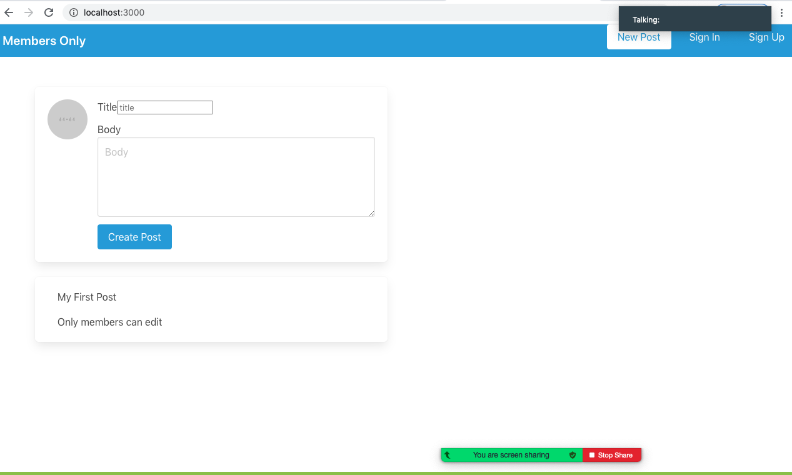

# Project: Members Only

In this project, we build an exclusive clubhouse where members can write posts about non-members.  Inside the clubhouse, members can see who the author of a post is but, outside, they can only see the story and wonder who wrote it. You can get the full project description [here](https://www.theodinproject.com/courses/ruby-on-rails/lessons/authentication). 

## Screenshot

## Built with

- Ruby on Rails

## Linters

- Rubocop
- Stylelint

## Getting Started

Follow the steps below to get a local copy running:

### Install
- To run this project on local computer, you need to install Ruby on Rails.
    - For Windows users, visit [Ruby Installer](https://rubyinstaller.org/)
    - For MocOS and Linux users, visit the [Ruby Official Site](https://www.ruby-lang.org/en/downloads/) for instructions.
- Then clone the project by by typing `git clone git@github.com:mohamedSabry0/members_only.git`.

### Run App
- Type `bundle install` in the root directory of the project.
- Type `rails server` in the root directory of the project.
- Type `rails db:migrate` in the root directory of the project.
- Open a browser, copy and paste `http://localhost:3000`

## Authors

👤 Tazoh Yanick Tazoh

- GitHub: [@t-yanick](https://github.com/t-yanick)
- Twitter: [@ElTazoh](https://twitter.com/ElTazoh)
- Linkedin: [Tazoh Yanick](https://linkedin.com/in/tazoh-yanick-5a978764)

👤 Mohamed Sabry

- Github: [@mohamedSabry0](https://github.com/mohamedSabry0)
- Twitter: [twitter profile](https://twitter.com/mohsmh0)
- Linkedin: [linkedin profile](https://www.linkedin.com/in/mohamed-sabry0/)

## 🤝 Contributing

Contributions, issues, and feature requests are welcome!

Feel free to check the [issues page](https://github.com/mohamedSabry0/members_only/issues).

## Show your support

Give a ⭐️ if you like this project!

## Acknowledgments

- [Team 139 - The Thanatos](https://microverse-students.slack.com/archives/C016RJURVCL)
- [Microverse](https://www.microverse.org/)
- [The Odin Project](https://www.theodinproject.com/courses/ruby-on-rails/lessons/authentication)

## 📝 License

This project is [MIT]() licensed.

